# DSA210 Term Project — What Drives Tourism to Turkey: Climate Differences or Economic Factors?

**Student:** Tutku Sıla Baş  
**Institution:** Sabancı University  
**Course:** DSA210 — Introduction to Data Science  
**Term:** Spring 2025-2026  
🌐 **Project Website:** https://tutkusilabas.github.io/DSA210_PROJECT/

---

## 1. Introduction

### 1.1 Motivation

One of my favorite activities during high school was walking from Sultanahmet to Eminönü to buy coffee from Kurukahveci Mehmet Efendi. This route is one of Istanbul’s most touristic and historically dense walking paths, and I often found myself observing the foreign visitors around me as I walked. I would wonder where they came from, what made them choose Istanbul, and what kind of motivation brought them to that specific street at that specific moment. Were they attracted by the city’s cultural and historical appeal, by the weather, by the affordability of Turkey, or simply by the timing of their holidays?

That personal curiosity became the starting point of this project. Tourism is one of the clearest ways to observe how geography, economics, and human behavior interact. A tourist arrival is not only a travel event; it is also a data point. When millions of these data points are collected across countries and months, they can reveal whether people are responding more to climate, price conditions, calendar seasonality, or external shocks.

This project studies foreign tourist arrivals to Turkey between **2015 and 2025**. Turkey is an especially interesting case because it combines several forces at once: strong summer tourism seasonality, major source markets with very different climates, large currency and inflation changes, the COVID-19 disruption, and a tourism sector that is highly relevant to the national economy.

The basic intuition is simple. Tourists may come to Turkey because the country is warmer, sunnier, or more suitable for summer holidays. But they may also come because exchange-rate movements and inflation make Turkey relatively cheaper than other destinations. These two explanations point to different mechanisms. If climate is the stronger driver, then tourism demand is mainly shaped by seasonal and geographic preferences. If economic factors are stronger, then Turkey’s attractiveness depends more on affordability and price competitiveness.

### 1.2 Research Question

> **What drives foreign tourism to Turkey more strongly: climate differences or economic factors?**

This question is intentionally comparative. Instead of testing only one variable, the project compares two groups of explanations:

1. **Climate and seasonality:** Istanbul temperature, source-country temperature, temperature gap, and summer concentration.  
2. **Economic factors:** Turkey inflation, source-country inflation, inflation difference, and exchange-rate competitiveness.

### 1.3 Objectives

The project has six main objectives:

1. Build a clean monthly tourism dataset for Turkey between 2015 and 2025.  
2. Merge tourism data with climate, inflation, and exchange-rate variables.  
3. Perform exploratory data analysis to identify seasonality, source-country concentration, and COVID disruption.  
4. Test seven hypotheses using statistical methods.  
5. Use machine learning models to validate whether the same drivers appear in predictive settings.  
6. Build an interactive web application that allows users to explore country-level tourism patterns.

---

## 2. Data and Methodology

### 2.1 Data Sources

The project combines five main data streams.

| Data | Source | Frequency | Role in Project |
|---|---|---:|---|
| Foreign tourist arrivals | Republic of Türkiye Ministry of Culture and Tourism | Monthly | Main dependent variable |
| Turkey CPI inflation | TÜİK / TURKSTAT | Monthly | Domestic economic condition |
| Source-country inflation | Eurostat HICP and World Bank | Monthly / annual | Home-country economic condition |
| Exchange rates | Eurostat bilateral monthly exchange-rate series | Monthly | Price competitiveness channel |
| Temperature | Open-Meteo Historical Weather Archive / ERA5 | Daily aggregated to monthly | Climate and temperature-gap measures |

The tourism files from the Ministry of Culture and Tourism use different structures across years. Earlier files contain Turkish column names, while later files use English names. The cleaning pipeline handles both formats and standardizes the output into a consistent monthly panel.

### 2.2 Country Coverage

The final country-level analysis focuses on the major source countries in the tourism data:

- Germany  
- Russia  
- United Kingdom  
- Bulgaria  
- Iran  
- Georgia  
- Netherlands  
- Iraq  
- Saudi Arabia  
- Poland  

These countries represent a large share of Turkey’s foreign arrivals and provide variation in geography, climate, and economic background.

### 2.3 Data Cleaning

The data cleaning process included:

- harmonizing country names across Turkish, English, and ISO-style sources;
- removing aggregate rows such as `TOTAL`, continent names, and regional summaries;
- converting monthly tourism Excel files into one long-format dataset;
- aggregating daily weather data into monthly averages;
- joining all datasets using `(year, month)` and `(year, month, country)` keys;
- marking source-country inflation values that use annual World Bank data rather than monthly Eurostat data.

### 2.4 Feature Engineering

The most important engineered variables are:

| Feature | Formula | Interpretation |
|---|---|---|
| **Temperature gap** | source-country temperature − Turkey temperature | Negative values mean Turkey is warmer than the source country. |
| **Inflation difference** | Turkey inflation − source-country inflation | Measures relative inflation pressure. |
| **Summer share** | June–September arrivals / annual arrivals | Measures how concentrated each country’s arrivals are in peak season. |
| **COVID indicator** | 2020–2021 dummy | Separates pandemic years from normal tourism behavior. |

The temperature gap is especially important for testing the “escape-the-cold” explanation. If tourists are coming because Turkey is warmer than home, arrivals should rise when the source country is colder relative to Turkey.

---

## 3. Exploratory Data Analysis

Exploratory analysis was used to understand the shape of the tourism data before formal testing.

### 3.1 Annual Tourism Pattern

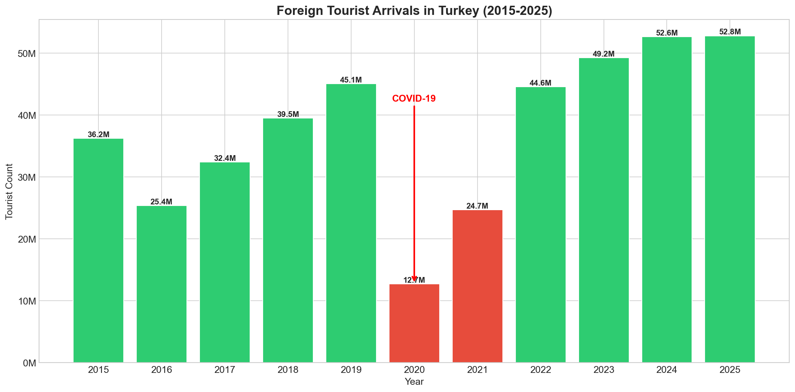

*Figure 1. Annual foreign arrivals to Turkey, 2015–2025. The chart shows steady pre-pandemic growth, a sharp collapse in 2020–2021, and a strong recovery after travel restrictions eased.*

The annual trend reveals the most important structural break in the dataset: COVID-19. The pandemic years cannot be treated as normal observations because international travel restrictions created a shock much larger than ordinary climate or economic variation. For this reason, COVID years are excluded from several correlation tests and then tested separately in the COVID structural-break hypothesis.

### 3.2 Monthly Seasonality

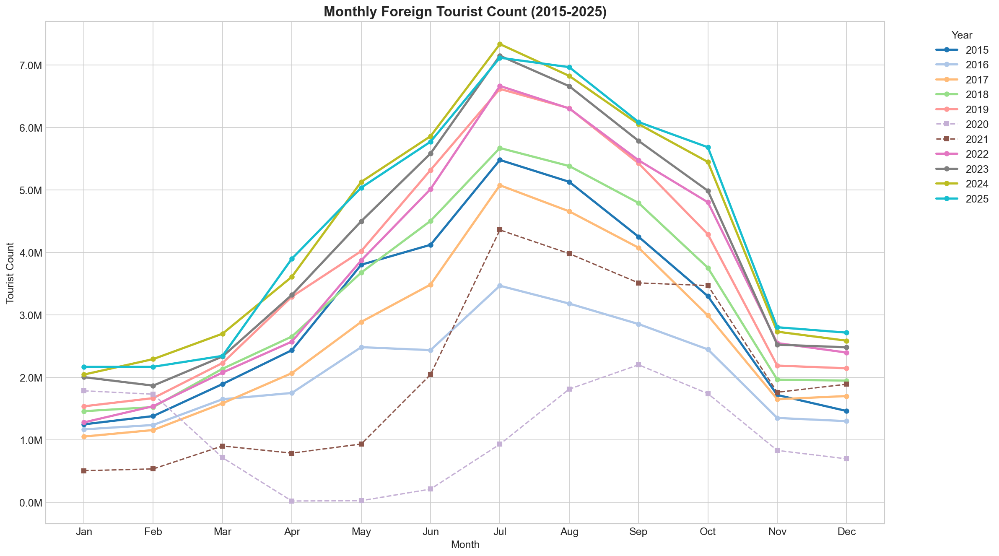

*Figure 2. Monthly arrivals by year. Most years show a similar pattern: low winter arrivals, rising spring demand, a July–August peak, and a decline in autumn.*

The monthly chart shows that seasonality is one of the strongest patterns in the entire project. Turkey receives many more foreign visitors in summer than in winter. This does not automatically prove that temperature causes tourism, because summer also overlaps with school holidays and work-leave calendars. However, it strongly suggests that any useful model must account for the seasonal structure.

### 3.3 Source-Country Structure

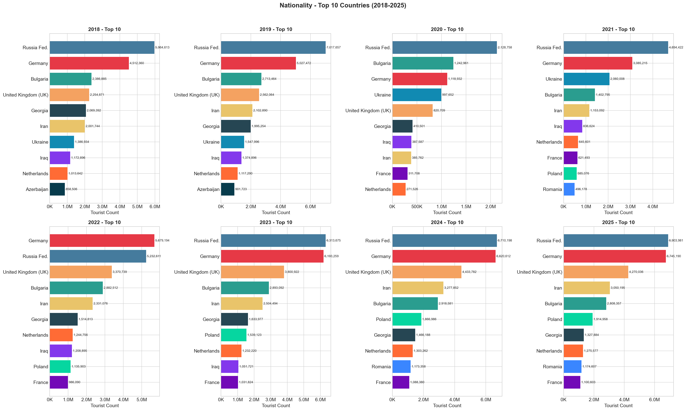

*Figure 3. Top source countries by year. Germany and Russia are consistently among the largest source markets, while countries such as the United Kingdom, Bulgaria, Iran, Georgia, and the Netherlands form the next major group.*

The source-country distribution matters because aggregate results are partly shaped by the largest markets. Germany and Russia contribute heavily to total arrivals, so patterns in those countries can influence the national-level results.

### 3.4 Climate Correlation Structure

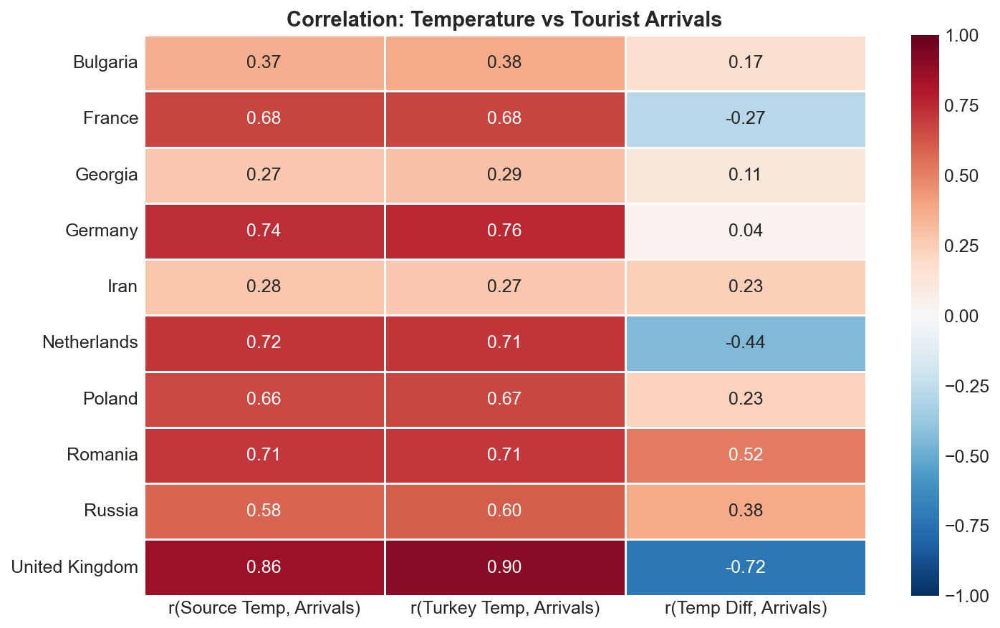

*Figure 4. Climate correlation heatmap. The chart compares arrivals with Turkey temperature, source-country temperature, and temperature gap across countries.*

This figure shows that the climate signal is not identical across source countries. For many countries, arrivals rise when both Turkey and the source country are warm, which is more consistent with summer holiday behavior than pure escape-the-cold behavior. For a smaller set of countries, the temperature-gap result suggests a clearer escape-the-cold pattern.

---

## 4. Hypothesis Testing

The project keeps the H1–H7 labels because they make the analysis easy to reference. However, each hypothesis is written with an explanatory title so that the reader can immediately understand what is being measured.

### 4.1 Summary of Hypotheses

| Hypothesis | What is Being Measured? | Method | Result |
|---|---|---|---|
| **H1 — Istanbul temperature and total tourist arrivals** | Whether warmer months in Turkey are associated with higher total arrivals. | Pearson correlation | ✅ Strongly supported |
| **H2 — Turkey inflation and tourism demand** | Whether Turkey becoming more price-competitive is associated with more arrivals. | Pearson correlation | ✅ Supported, weaker |
| **H3 — Source-country inflation and outbound travel to Turkey** | Whether inflation in the visitor’s home country affects arrivals to Turkey. | Country-level correlations | ⚠️ Mixed |
| **H4 — Temperature gap and escape-the-cold tourism** | Whether visitors come when Turkey is warmer than their home country. | Country-level correlations | ⚠️ Partially supported |
| **H5 — Climate versus economics** | Whether climate explains more variance than economic indicators. | R² comparison / dependent correlation test | ✅ Climate stronger |
| **H6 — Lagged economic effects** | Whether economic indicators affect arrivals after several months. | Lag-correlation analysis | ⚠️ Inconclusive |
| **H7 — COVID-19 structural break** | Whether pandemic years differ statistically from non-pandemic years. | Welch’s t-test | ✅ Confirmed |

### 4.2 H1 — Istanbul Temperature and Total Tourist Arrivals

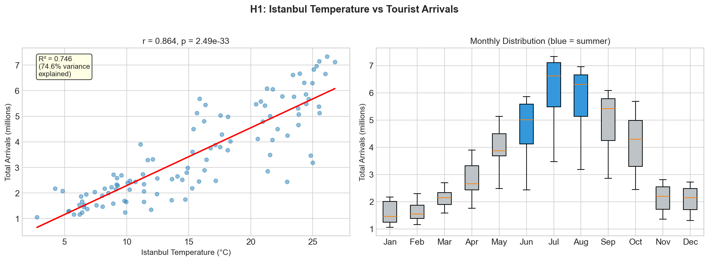

*Figure 5. Istanbul monthly mean temperature versus total monthly arrivals. Each point represents one month, excluding COVID years where appropriate.*

**What H1 measures:**  
H1 tests whether warmer months in Turkey correspond to higher total foreign tourist arrivals. This is the simplest climate test in the project. If Istanbul temperature is strongly associated with arrivals, then climate or seasonality is likely an important driver.

**Interpretation:**  
The result is strongly supported. Arrivals increase as Istanbul temperature rises. However, the result should be interpreted carefully because temperature is highly connected to the summer holiday calendar. The finding shows a strong climate-seasonality relationship, not pure temperature causality.

### 4.3 H2 — Turkey Inflation and Tourism Demand

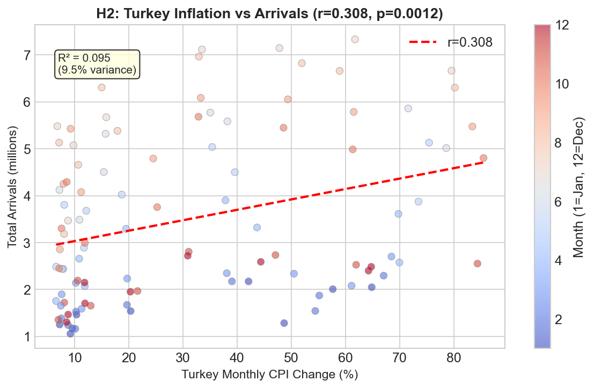

*Figure 6. Turkey inflation versus total monthly arrivals. The relationship is positive but weaker than the temperature relationship.*

**What H2 measures:**  
H2 asks whether Turkey’s inflation and related price competitiveness are associated with higher tourist arrivals. The economic intuition is that high inflation often coincides with currency depreciation, which can make Turkey cheaper for foreign visitors.

**Interpretation:**  
The result is supported but weaker than H1. Economics matters, but Turkey CPI alone does not explain as much variation as temperature. This suggests that the economic channel exists, but it is not the dominant single explanation at the monthly aggregate level.

### 4.4 H3 — Source-Country Inflation and Outbound Travel to Turkey

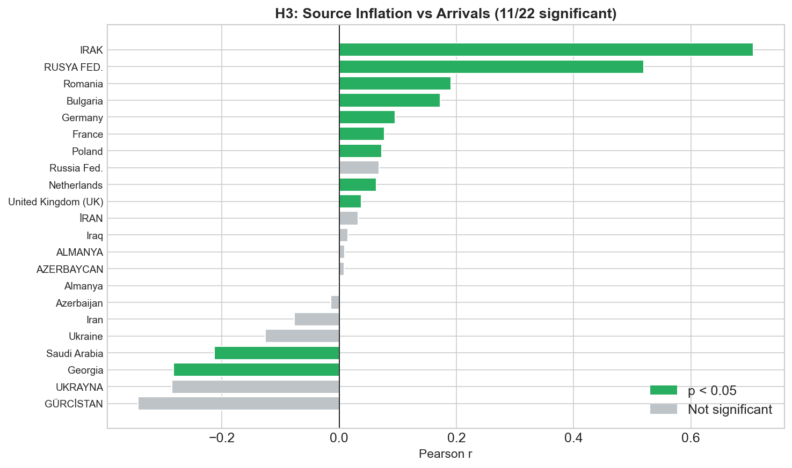

*Figure 7. Source-country inflation correlations. Some countries show positive relationships, some show weak or mixed relationships, and the direction is not universal.*

**What H3 measures:**  
H3 tests whether inflation in the tourist’s home country changes travel demand to Turkey. This can operate in two opposite directions. Higher home-country inflation may reduce disposable income and lower travel. But it may also push tourists toward relatively cheaper destinations such as Turkey.

**Interpretation:**  
The result is mixed because the sign and significance differ across countries. Source-country inflation is therefore not a universal tourism driver. It may matter for some markets, but it does not produce one consistent cross-country rule.

### 4.5 H4 — Temperature Gap and Escape-the-Cold Tourism

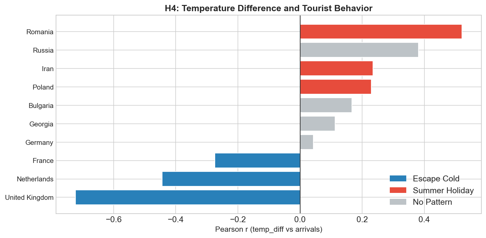

*Figure 8. Temperature-gap correlations by country. The test asks whether arrivals rise when Turkey is warmer than the source country.*

**What H4 measures:**  
H4 tests the specific “escape-the-cold” idea. It is different from H1. H1 only asks whether Turkey’s own temperature is associated with arrivals. H4 asks whether the temperature difference between Turkey and the visitor’s home country matters.

**Interpretation:**  
The result is partially supported. Some countries show patterns consistent with escaping colder home weather, but many others follow a summer-holiday pattern instead. This means that the escape-the-cold explanation is real for some markets but not the main explanation for all tourism to Turkey.

### 4.6 H5 — Climate Versus Economics

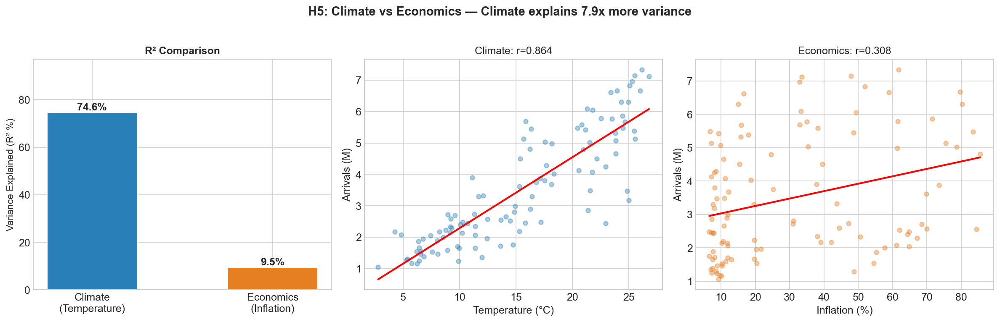

*Figure 9. Central comparison between climate and economics. Climate explains more variance than Turkey CPI in the aggregate monthly arrival data.*

**What H5 measures:**  
H5 is the central hypothesis of the project. It compares the explanatory strength of climate and economic variables. Instead of asking whether each factor matters separately, it asks which one explains more variation in monthly arrivals.

**Interpretation:**  
The result supports the climate/seasonality explanation. Istanbul temperature explains substantially more variance than Turkey CPI alone. This is the clearest statistical answer to the main research question. However, the machine learning results add nuance by showing that exchange-rate variables also carry meaningful predictive information.

### 4.7 H6 — Lagged Economic Effects

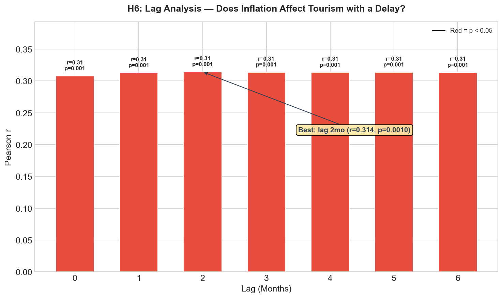

*Figure 10. Lag-correlation analysis. The test checks whether economic variables affect arrivals after a delay from 0 to 6 months.*

**What H6 measures:**  
H6 tests whether tourists respond to economic conditions with a planning delay. For example, exchange-rate changes or inflation may influence travel decisions several months before the actual trip.

**Interpretation:**  
The result is inconclusive. No single lag clearly dominates. This may be because different tourist segments plan at different horizons: nearby visitors may decide quickly, while long-distance tourists may book months earlier.

### 4.8 H7 — COVID-19 Structural Break

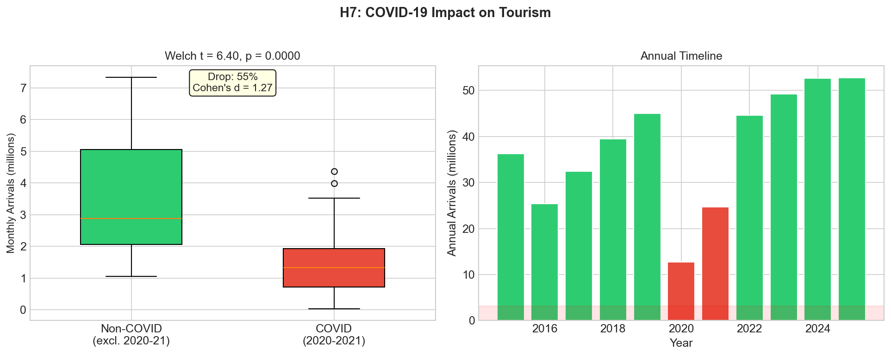

*Figure 11. COVID versus non-COVID arrivals. The pandemic years are statistically different from normal tourism years.*

**What H7 measures:**  
H7 tests whether 2020–2021 represent a structural break rather than normal variation. This is important because COVID restrictions disrupted global travel in a way that cannot be explained by ordinary climate or economic variables.

**Interpretation:**  
The result is confirmed. COVID years are statistically distinct from non-COVID years, which justifies treating them separately in the rest of the analysis.

---

## 5. Country-Level Interpretation

The country-level analysis shows that the same aggregate conclusion does not apply equally to every source market.

### 5.1 Germany and Russia

Germany and Russia are the two largest source markets in the dataset. Their size means they strongly influence aggregate arrival patterns. Both show strong seasonality, but the exact interpretation differs by country and year.

### 5.2 United Kingdom

The United Kingdom shows one of the clearer temperature-gap patterns. This means that the difference between UK weather and Turkey weather is more informative for understanding UK arrivals than it is for some other countries.

### 5.3 Bulgaria and Georgia

Nearby countries such as Bulgaria and Georgia may include more short-distance or regional travel. Their arrivals may respond differently from long-haul or package-tour markets because travel costs, planning windows, and border proximity are different.

### 5.4 Iran, Iraq, Saudi Arabia, Netherlands, and Poland

These countries show different mixes of seasonality, economic sensitivity, and climate patterns. The main lesson is that country-level segmentation matters. A single national-level tourism model can hide differences between source markets.

---

## 6. Machine Learning Analysis

Machine learning is used to validate the statistical findings and test whether predictive models discover similar patterns.

### 6.1 Regression: Predicting Monthly Arrivals

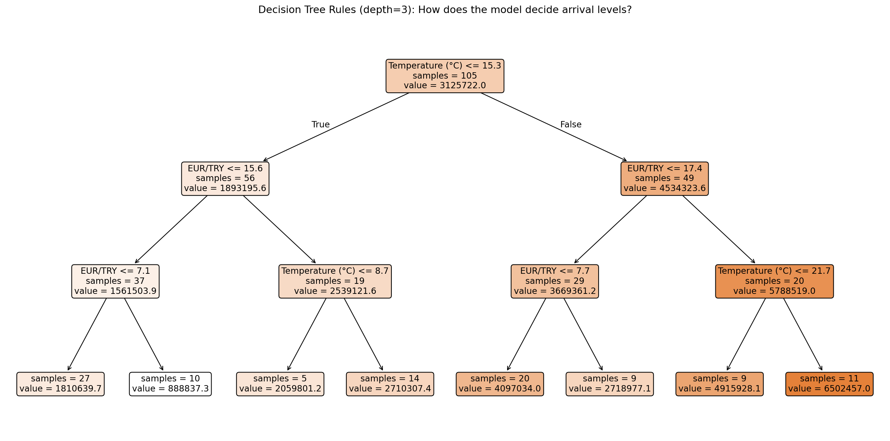

*Figure 12. Decision Tree regression model. The first major split is based on temperature, supporting the importance of the climate-seasonality signal.*

A Linear Regression model and a shallow Decision Tree model were trained to predict monthly arrivals using climate and economic variables. The Decision Tree is useful because its structure shows which variable the model chooses first when splitting the data. The first split is temperature-based, which supports the H1 and H5 findings.

### 6.2 Classification: High Season versus Low Season

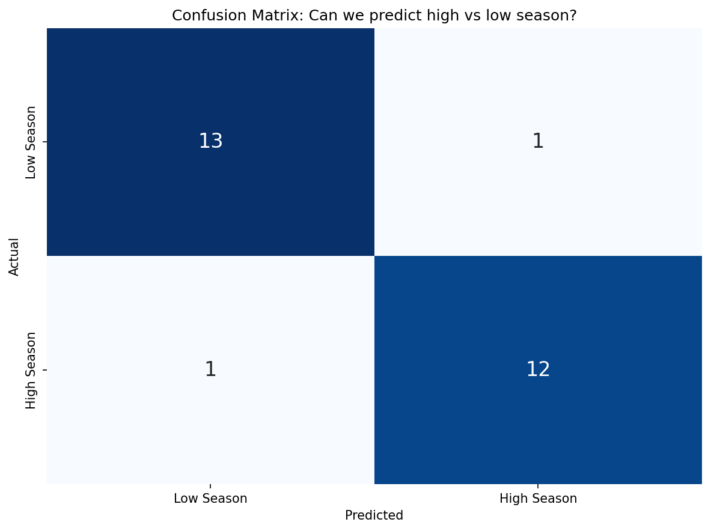

*Figure 13. Confusion matrix for high-season versus low-season classification. The model performs well because tourism seasonality is highly structured.*

The classification task converts monthly arrivals into a binary problem: high season or low season. The model performs strongly, which indicates that the combination of temperature and economic variables can separate high-tourism months from low-tourism months.

### 6.3 Feature Importance

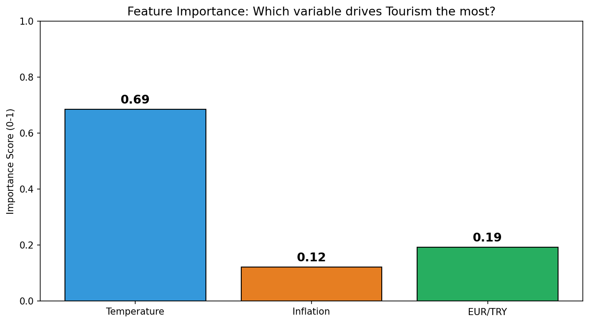

*Figure 14. Random Forest feature importance. Temperature ranks as the strongest single predictor, while exchange rate and inflation remain important.*

Random Forest feature importance gives the most direct machine-learning comparison of variables. Temperature is the strongest individual feature. However, the exchange-rate channel is also important, meaning the final interpretation should not ignore economics.

### 6.4 Clustering

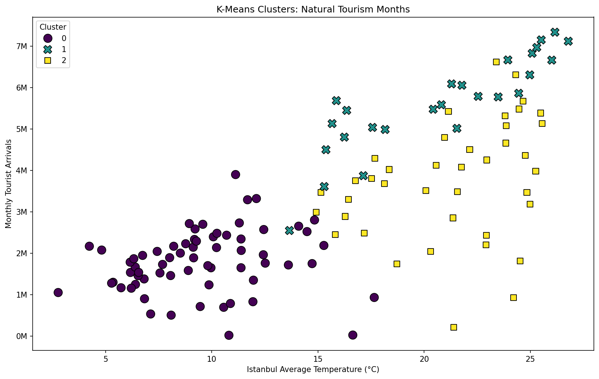

*Figure 15. K-Means clustering. The clustering structure reflects low, shoulder, and peak tourism seasons.*

K-Means clustering was used as an unsupervised test. Since the model is not directly given a “season” label, the emergence of seasonal clusters supports the idea that seasonality is embedded in the feature space.

---

## 7. Web Application Development

### 7.1 Purpose of the Web Application

The web application was developed as an interactive extension of the report. While the report presents the full methodology and statistical results, the website allows users to explore the findings more visually and dynamically.

The site is titled **Climate or Currency? Country Explorer** and can be opened directly from the project website link:

🌐 **Web Application:** https://tutkusilabas.github.io/DSA210_PROJECT/

### 7.2 What the Website Does

The website allows users to:

1. read the project question and main conclusion;
2. choose a source country from an interactive country list;
3. view the country’s total arrival rank;
4. see the year when the most tourists came from that country;
5. identify the months when arrivals are highest;
6. compare the country’s seasonality ranking;
7. inspect whether the country supports the temperature-gap / escape-the-cold hypothesis;
8. inspect whether source-country inflation is related to arrivals;
9. connect country-level patterns to the broader EDA and machine learning findings.

### 7.3 Deployment

The website is provided as a static HTML/CSS/JavaScript application and is published through GitHub Pages. After deployment, users can open it directly from the project website link without installing anything.

---

## 8. Limitations and Future Work

### 8.1 Seasonality and Temperature Are Difficult to Separate

A major limitation is that temperature and holiday calendars move together. July and August are warmer, but they are also major vacation months. Therefore, the temperature variable partly captures actual weather and partly captures the institutional timing of holidays.

### 8.2 Inflation Data Are Not Equally Granular Across Countries

Eurostat countries have monthly inflation data, while several non-Eurostat countries rely on annual World Bank values repeated across months. This weakens monthly inflation analysis for those countries.

### 8.3 Correlation Is Not Causation

The project uses correlation tests, variance comparisons, and machine learning feature importance. These methods show association and predictive relevance, but they do not prove causality. A causal design would require stronger identification strategies.

### 8.4 Missing Variables

Important tourism drivers are not fully included, such as:

- visa restrictions,
- flight availability,
- hotel prices,
- package tour prices,
- geopolitical tensions,
- marketing campaigns,
- school holiday calendars by country.

### 8.5 Future Work

Future versions could improve the project by adding:

- panel regression with country fixed effects;
- country-specific monthly CPI series for all source markets;
- flight and hotel price data;
- longer historical coverage before 2015;
- a causal inference design around exchange-rate shocks or visa-policy changes;
- SHAP values for more interpretable machine learning results.

---

## 9. AI Usage Disclaimer

In keeping with Sabancı University's academic integrity guidelines and DSA210 course policy, this section transparently documents how AI tools were used in the preparation of this project.

**Tools consulted.** OpenAI's ChatGPT and Anthropic's Claude were used as supporting assistants throughout the project.

**How AI assisted.**

- **Coding support** — debugging `pandas` merge operations on the multi-source monthly panel, resolving Eurostat TSV parsing edge cases (gzip decompression, comma-separated metadata columns, missing-value flag stripping), troubleshooting Open-Meteo API request loops, and refining Streamlit layout and custom CSS for the dashboard.
- **Writing support** — copy-editing report prose for clarity and tightening verbose passages without altering substantive content or argumentative structure. The voice, structure, and reasoning of every section were authored by the project author.
- **Methodological consultation** — sanity-checking the choice of Steiger's Z-test for comparing the dependent correlations in H5, the choice of `temperature_2m_mean` over alternative ERA5 variables, and the rationale for excluding the 2020–2021 COVID years from contemporaneous correlation analyses.

## 10. References and Tools

### 10.1 Data Sources

- Republic of Türkiye Ministry of Culture and Tourism  
- TÜİK / TURKSTAT  
- Eurostat HICP and exchange-rate datasets  
- World Bank Indicators  
- Open-Meteo Historical Weather Archive / ERA5  

### 10.2 Python Libraries and Tools

- `pandas` and `numpy` for data processing  
- `scipy` and `statsmodels` for statistical testing  
- `matplotlib`, `seaborn`, `plotly`, and `altair` for visualization  
- `scikit-learn` for machine learning  
- `jupyter` for notebook-based analysis  
- HTML, CSS, and JavaScript for the static web application  

---

## 11. Conclusion

The project finds that **climate and seasonality are the strongest single drivers of monthly tourism arrivals to Turkey**. Istanbul temperature explains more variation than Turkey CPI in the aggregate analysis, and machine learning models also identify temperature as the strongest individual feature.

However, the conclusion is not that economics is irrelevant. Exchange-rate competitiveness and inflation-related variables still contribute meaningful information, especially when the economic channel is represented through exchange rates rather than CPI alone.

The most accurate final interpretation is therefore:

> **Tourism to Turkey is primarily structured by climate and seasonality, while economic competitiveness acts as an important secondary driver. The balance between these forces varies by source country.**
